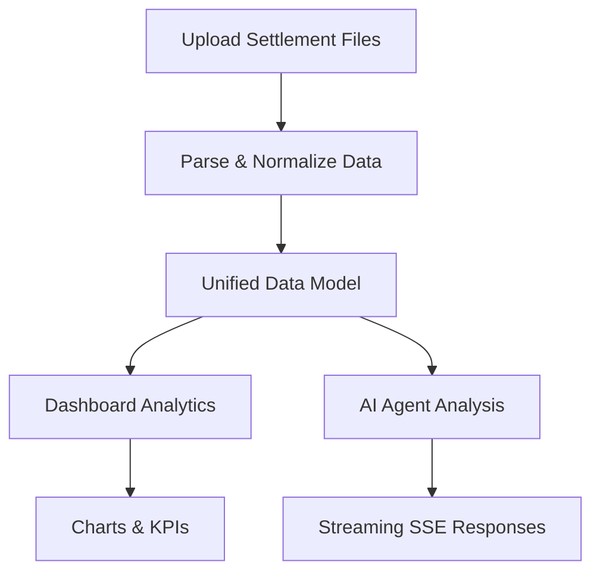

## 1. Product Overview
An e-commerce settlement analysis agent that processes and analyzes settlement data from Korean platforms (Coupang, Naver, Gmarket). It provides a unified dashboard and AI-driven insights for sellers to understand their revenue, fees, and profitability.

The target audience is Korean e-commerce sellers who manage multiple platforms and need consolidated financial analytics with AI-powered recommendations.

## 2. Core Features

### 2.1 User Roles
| Role | Description |
|------|-------------|
| Seller | Uploads settlement files, views dashboard, interacts with AI agent for insights |

### 2.2 Feature Module
Our SalesLens application consists of the following main pages:
1. **Dashboard**: Unified analytics view with KPIs, charts, and platform breakdowns.
2. **Chat Agent**: AI-powered analysis assistant for natural language queries on settlement data.
3. **Session Management**: Sidebar for managing multiple analysis sessions.

### 2.3 Page Details
| Page Name | Module Name | Feature description |
|-----------|-------------|---------------------|
| Dashboard | KPI Cards | Display key metrics: total revenue, fees, net profit, order count per platform. |
| Dashboard | Revenue Overview | Stacked bar/line chart showing revenue trends across platforms. |
| Dashboard | Fee Analysis | Breakdown of platform fees, commissions, and deductions. |
| Dashboard | Sales Trend | Time-series visualization of sales volume and growth. |
| Dashboard | Product Profit | Per-product profitability analysis with margin calculations. |
| Dashboard | Data Health | File upload status, parsing quality, and data completeness indicators. |
| Dashboard | Platform Legend | Visual legend for Coupang, Naver, Gmarket color coding. |
| Chat | Chat Landing | Welcome screen with suggested prompts for common analyses. |
| Chat | Chat Input | Message input with file upload capability for settlement CSVs/Excel. |
| Chat | Chat Message | Streaming AI responses with markdown rendering and structured data. |
| Sidebar | Session Sidebar | List of past analysis sessions with create/switch/delete actions. |

## 3. Core Process
Sellers upload settlement files (CSV/Excel) from Korean e-commerce platforms. The system parses and normalizes the data into a unified model, then presents analytics via dashboard charts and an AI agent that can answer questions about the data.

## 4. User Interface Design

### 4.1 Design Style
- Primary framework: IBM Carbon Design System
- Secondary components: BlueprintJS for specialized UI elements
- Color scheme: Platform-specific (Coupang red, Naver green, Gmarket blue)
- Font: IBM Plex (via @ibm/plex)
- Layout style: Dashboard grid with sidebar navigation
- Theme: Dark/Light mode support via ThemeProvider

### 4.2 Page Design Overview
| Page Name | Module Name | UI Elements |
|-----------|-------------|-------------|
| Dashboard | KPI Cards | Carbon Tile components with metric values, trend indicators, platform icons |
| Dashboard | Revenue Overview | Carbon Charts line/bar combo with platform color coding |
| Dashboard | Fee Analysis | Carbon Charts donut/stacked bar for fee breakdown |
| Dashboard | Sales Trend | Carbon Charts time-series with date range selector |
| Dashboard | Product Profit | Carbon DataTable with sortable columns, profit margin badges |
| Dashboard | Data Health | Progress indicators, file status cards, validation summaries |
| Chat | Chat Interface | Message bubbles with markdown support, streaming indicators, file attachment |
| Sidebar | Session List | Carbon StructuredList with session names, timestamps, action menus |

### 4.3 Responsiveness
Desktop-first design using Carbon's responsive grid system. Mobile-optimized with collapsible sidebar and stacked dashboard cards.

### 4.4 Internationalization
Multi-language support (Korean/English) via custom LanguageContext with language switcher component.