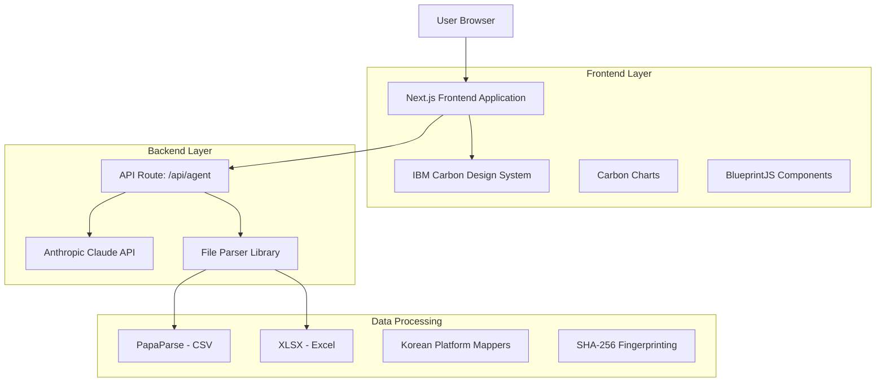

## 1. Architecture design

## 2. Technology Description
- Frontend: Next.js@16 + React@19 + IBM Carbon Design System
- Styling: SASS (.scss) with Carbon themes
- Charts: @carbon/charts-react
- AI/Agent: Anthropic SDK (Claude models) via SSE streaming
- Data Parsing: PapaParse (CSV), XLSX (Excel)
- Additional UI: BlueprintJS for specialized components
- i18n: Custom LanguageContext (KO/EN)
- Backend: Next.js API Routes (App Router)

## 3. Route definitions
| Route | Purpose |
|-------|---------|
| / | Main application page with dashboard and chat interface |
| /api/agent | SSE endpoint for AI agent interactions with streaming responses |

## 4. API definitions
| Endpoint | Method | Description |
|----------|--------|-------------|
| /api/agent | POST | Receives user messages and settlement data context, returns streaming SSE responses from Claude AI with multi-agent orchestration (comprehensive, optimization, risk analysis) |

## 5. Server architecture diagram
Single Next.js application with API routes serving as the backend. Anthropic Claude API is called server-side via the Anthropic SDK. SSE (Server-Sent Events) pattern used for real-time streaming of AI responses to the client.

## 6. Data model
Unified settlement data model supporting Coupang, Naver, and Gmarket platforms:
- Settlement records normalized to common schema (date, product, quantity, revenue, fees, net)
- Platform-specific field mapping via mapper library
- File fingerprinting (SHA-256) for duplicate detection
- Session-based data isolation for multi-session support